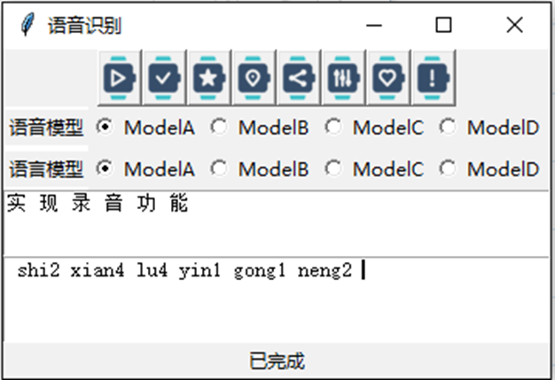

# ASRFrame
- 没有什么是10层卷积解决不了的。
- 如果有，就再来十层，再加个残差，再加个...

再加个star吧！

# 介绍
项目链接：https://github.com/sailist/ASRFrame

一个完整的语音识别框架，包括从数据清洗接口，数据读取接口到语音模型、声学模型、到最后的模型整合和UI的一整套流程

目前声学部分拼音识别准确率已经比较高了，但语言模型仍然存在诸多问题需要解决，因此开源该项目，希望大家群策群力，将它的效果进行提升。

# 本项目的优点
- 数据接口易于使用，常用的几个数据集已经实现了接口，只需要下载，解压，在配置文件中更改路径后，即可运行清洗方法，并自动获取所有音频和标注
- 模型类已经写好，只需要关注模型结构，并保证输入输出格式，之后只需不到10行代码即可完成自动保存、训练
- 集成了目前的几个开源项目中的模型，并训练了相应的模型文件
- 较为详细的注释和清晰的代码，易于学习和修改

# 本项目的缺点
- 识别率仍然是一个大痛点，语音到拼音的识别能有大概80%以上的识别率（不过即使识别错了，也能保证是音近字），但存在100%识别正确的可能，拼音到汉字可能会更低，但也存在100%识别正确的可能，这跟环境、语速、玄学有关
- 封装的有点太死了，如果要把模型取出来单独用可能会比较麻烦

# 部署方法
本项目仅需Python及其相关依赖包即可，省时省力，同时在realease中我提供了预训练的权重

## 系统要求
Python
- Distance (>=0.1.3)
- jieba (>=0.39)
- Keras (>=2.2.4)
- librosa (>=0.6.3)
- numpy (>=1.16.2)
- pypinyin (>=0.35.3)
- python-speech-features (>=0.6)
- scipy (>=1.2.1)
- tensorflow (>=1.13.1)
- thulac (>=0.2.0)
- pydub (>=0.23.1)

## 安装依赖
```bash
pip install -r requirement.txt
```

## 使用
### 下载数据集
打开网页链接后仅下载链接名对应的文件即可

##### THCHS30
万余条语音文件，大约40小时。内容以文章诗句为主，全部为女声。（清华大学语音与语言技术中心（CSLT）出版）

下载链接：[data_thchs30.tgz](https://openslr.org/18/)

#### Free ST Chinese Mandarin Corpus
10万余条语音文件，大约100余小时。内容以平时的网上语音聊天和智能语音控制语句为主，855个不同说话者，同时有男声和女声，适合多种场景下使用。

下载链接：[ST-CMDS-20170001_1-OS.tar.gz](https://openslr.org/38/)
#### AISHELL开源版
包含178小时的开源版数据。包含400个来自中国不同地区、具有不同的口音的人的声音。录音质量高，通过专业的语音注释和严格的质量检查，手动转录准确率达到95％以上。

下载链接：[data_aishell.tgz](https://openslr.org/33/)

#### Primewords Chinese Corpus Set 1
包含了大约100小时的中文语音数据。语料库由296名母语为英语的智能手机录制。转录准确度大于98％，置信水平为95％。抄本和话语之间的映射以JSON格式给出。

下载链接：[primewords_md_2018_set1.tar.gz](https://openslr.org/47/)

#### Aidatatang_200zh
200小时(当前时长最长的中文开源语音数据集)，由Android系统手机（16kHz，16位）和iOS系统手机（16kHz，16位）记录。录音环境安静，录音者性别、年龄均匀分布。每个句子的手动转录准确率大于98％。

下载链接：[aidatatang_200zh.tgz](https://openslr.org/62/)

#### wiki数据集（用于语言模型训练，其余用于声学模型）
104万个词条(1,043,224条; 原始文件大小1.6G，压缩文件519M；数据更新时间：2019.2.7)

该项目下：[1.维基百科json版(wiki2019zh)](https://github.com/brightmart/nlp_chinese_corpus)

### 配置路径
在config下，配置相应的语料路径，根路径即可

### 清洗声学语料
数据集的格式不太一样，因此需要稍微清洗一下，这个过程包括生成wav文件下相应的标注文件（如果没有），标注拼音（如果没有）
```bash
python run_clean.py
```
等待数据清洗完成，如果只下了一部分数据集可以选择性的清洗

其中拼音以空格隔开，并忽略所有汉字中的空格，英文字母，数字
> 标注拼音使用 pypinyin

最终所有数据集的格式如下：不管目录结构，一个wav文件下对应一个同名文本文件作为标签，文本内第一行是中文，第二行是拼音

会得到如下格式的输出
```text
Load pinyin dict. Max index = 1432.

Load pinyin dict. Max index = 1432.
231706,/data/voicerec/z200/G0155/session01/T0055G0155S0227.txt.z200 finished.

Load pinyin dict. Max index = 1432.
141599,/data/voicerec/ALShell-1/data_aishell/wav/dev/S0762/BAC009S0762W0332.wavAishell finished.

Load pinyin dict. Max index = 1432.
50381,2a16115c-6927-4e8a-a738-46d59f678296.wav.Primewords finished.

Load pinyin dict. Max index = 1432.
102599,/data/voicerec/Free ST Chinese Mandarin Corpus/ST-CMDS-20170001_1-OS/20170001P00366I0025.txt.ST_CMDS finished.

```

### 处理用于语言模型的语料
这个由于时间关系没有去找更多的语料，因此只写了清洗wiki的方法:
```bash
python run_build_corpus.py
```
这次清洗大概要跑大概两天以上的时间，会生成约2000w条的语料

### 统计数据信息
```bash
python run_summary.py
```
对下载下来的数据集进行统计（只针对声学模型），输出相应的信息和图片，如果没有意外，控制台输出如下：
```text
start to summary the Thchs30 dataset
checked 13375 wav files:/data/voicerec/dataset/dataset/thchs30-openslr/data_thchs30/data/D6_938.wavv
max audio len = 261000, max timestamp = (281, 603) ,min audio len = 71424, sample = 16000
checked 13375 label files:/data/voicerec/dataset/dataset/thchs30-openslr/data_thchs30/data/D6_938.wav.trnn
max label len = 48, min label len = 19, pinpin coverage:1208
result from 13376 sample, used 3.7486759999999997 sec
Load pinyin dict. Max index = 1436.

start to summary the AiShell dataset
checked 141599 wav files:/data/voicerec/ALShell-1/data_aishell/wav/train/S0003/BAC009S0003W0427.wav
max audio len = 235199, max timestamp = (281, 544) ,min audio len = 19680, sample = 16000
checked 141599 label files:/data/voicerec/ALShell-1/data_aishell/wav/train/S0003/BAC009S0003W0427.txt
max label len = 44, min label len = 1, pinpin coverage:1196
result from 141600 sample, used 98.877352 sec
Load pinyin dict. Max index = 1436.

start to summary the Primewords dataset
checked 50369 wav files:/data/voicerec/Primewords Chinese Corpus Set 1/primewords_md_2018_set1/audio_files/5/57/5732d955-b4f4-41a4-b60f-32b42da573af.wav
max audio len = 320640, max timestamp = (281, 741) ,min audio len = 21120, sample = 16000
checked 50369 label files:/data/voicerec/Primewords Chinese Corpus Set 1/primewords_md_2018_set1/audio_files/5/57/5732d955-b4f4-41a4-b60f-32b42da573af.txt
max label len = 35, min label len = 1, pinpin coverage:1231
result from 50370 sample, used 43.464597 sec
Load pinyin dict. Max index = 1436.

start to summary the ST_CMDS dataset
checked 102572 wav files:/data/voicerec/Free ST Chinese Mandarin Corpus/ST-CMDS-20170001_1-OS/20170001P00085A0053.wav
max audio len = 160416, max timestamp = (281, 371) ,min audio len = 19200, sample = 16000
checked 102572 label files:/data/voicerec/Free ST Chinese Mandarin Corpus/ST-CMDS-20170001_1-OS/20170001P00085A0053.txt
max label len = 22, min label len = 1, pinpin coverage:1194
result from 102573 sample, used 73.52233999999999 sec
Load pinyin dict. Max index = 1436.

start to summary the Z200 dataset
checked 231663 wav files:/data/voicerec/z200/G1428/session01/T0055G1428S0034.wav
max audio len = 348935, max timestamp = (281, 807) ,min audio len = 13811, sample = 16000
checked 231663 label files:/data/voicerec/z200/G1428/session01/T0055G1428S0034.txt
max label len = 43, min label len = 1, pinpin coverage:1182
result from 231664 sample, used 164.35475000000002 sec

```

### 训练
确保清洗完数据后运行`run_train.py`：注意查看一下文件，将要训练的模型的代码取消注释即可
```bash
python run_train.py
```
声学模型部分：目前保证没有运行错误能跑通的声学模型是DCBNN1D，如果不使用预训练权重的话第二个参数注意为None
语言模型部分：目前仅提供传统的HMM（使用的Pinyin2Hanzi的库）和Somial改（我称之为SOMM，具体分为SOMMalpha和SOMMword，结构相同，粒度不同）

### 真实使用
```bash
python run_real_predict.py
```
运行前，注意打开该文件更改一下模型的名称

### 使用UI
该项目搭建了一个简易的UI，对识别功能进行了封装
```bash
python run_ui.py
```

### 预训练模型的使用
预训练的权重我放到release中了，

- 声学模型部分效果最好的模型是DCBNN1D,模型名称`DCBNN1D_cur_best.h5`
- 语言模型部分目前效果最好的模型是SOMMalpha,预训练权重文件`SOMMalpha_step_18000.h5`

# 体系架构介绍
为了更好的理解项目架构，在这里做一些介绍
## acoustic：声学模型
- Reader是读取各种数据集，和数据生成器的类
- 其他py文件是各自的模型，调用通用的接口，compile、save、load、fit

## core：各种模型用到的层
- attention（好像不是很好用，不清楚是不是哪里实现错误了，求大佬看一下）
- positional embedding层（Transformer里的那个）
- ctc，包括求loss和decode方法的封装
- glu（线性门控单元）
- layer norm（层归一化，但实际上我只用了keras提供的batch norm2333）
- muti_gpu（据说是可以真正的多gpu并行运算，我没有试）
- base_model（基类，实现自己的模型如果按照基类的规范写，会非常的容易，只需要搭起模型，数据集和训练的过程完美的封装好了）

## examples：各种封装好的示例
- 数据集清洗（dataset_clean.py)
- 数据集统计（dataset_summary.py)
- 模型训练
- 真实使用测试

## feature：特征提取方法，实现了基于batch的提取
- 目前，MelFeature5是最好的实现，参考的[ASRT](https://github.com/nl8590687/ASRT_SpeechRecognition)这个项目的实现

## language：语言模型实现，目前实现进度：
- 一个简单的卷积网络（效果不好，废弃
- 基于Somiao输入法的架构构建的简化版（我称之为SOMM），分为两种粒度（字母级和拼音级），目前效果最好的是SOMMalpha，但仍然不能投入使用

## util：各种工具，包括：
- cleaner：清洗数据，包括上文提到的5种数据集的清洗代码，运行后会清洗为可供本项目内所有模型读取的统一格式
- mapmap：里面提供了三类字典，分别是拼音-index、字母-index、汉字-index，可以互相转换，支持字、list、batch三个级别的转换
- number_convert：用于阿拉伯数字到汉字的转换，复制的网上的代码，可读性可能不是很好...而且一些数字支持的不是很好
- reader：数据接口，提供了读取5类数据集的类，以及集成keras Sequence类实现的生成器（因为可以线程安全）
- evaluate：评估，提供了编辑距离的度量和归一化方法，用于直观验证准确率
- callbacks：keras模型训练中的回调函数，目前提供了用于提前停止，计时，绘制损失函数的三种回调函数
- audiotool：音频工具，提供了录音、去噪、端点检测三个类
- 其他：一些小工具，一般是临时使用的...就不写了

## visualization：可视化工具，用来提供一个UI工具
- 可读性可能有点差，但实际上功能比较齐全

## jointly：联合模型，对声学模型和语言模型的封装
- DCHMM：DCBNN1D+HMM(Pinyin2Hanzi)
- DCSOM：DCBNN1D+SOMM


# 结果展示
在吐字清洗，语速正常，普通话标注你的情况下，部分识别效果还是可以的，以及拼音大部分都能识别正确，但是语言模型还比较的差



## 声学模型部分
### DCBNN1D
直白的讲，我都没有想到我的这个模型效果会这么好，当初真的是非常惊喜的。

对于thchs30语料,dcbnn1d大概在batchsize=16,step=1000,epoch=100的时候会拟合,此时loss会下降到3.5左右，准确率会上升到近97%
这种情况算是过拟合，拿这个模型实际使用的话效果会很差(作为比对我把它命名为`overfit_thchs_DCBNN1D.h5`)，毕竟清华的数据集同质性太高了


不过因为是过拟合，所以我把在清华数据集上的效果作为baseline来测试我的其他模型（连清华数据集都过拟合不了，更谈不上泛化了）

在将其余用到的数据集全部丢进去后，仍然能有较好的训练结果，但没有办法完全拟合，大概loss会降到15左右，此时得到了release中提供的`DCBNN1D_cur_best.h5`


在听说aishell数据集质量不高后，去掉AiShell后又训练了

**截至2019年7月13日13:30:11，还在跑，在全部数据集上的loss降到了15左右，准确率稳定在75%**

### MCONM
这个是反向应用，在发现somiao输入法的结构非常好用后，我将其迁移到了声学模型部分来，搭建了这样的一个模型

**截至2019年7月13日13:29:29，还在跑，在thchs30的数据集上loss降到了55后再下降变得有些困难，正确率大概只有55%**


### WAVEM(wavenet)
wavenet的迁移版，参考了网上一个TensorFlow的开源实现，链接在参考链接中提供了。

**目前还没有跑过，等待更新**

### LAS(Listen,Attend and Spell)
该模型的思想来源于《Listen,Attend and Spell》这篇文章，借鉴了其中的Listener结构，我将其迁移到了keras上，这也是我最初尝试的有一定效果的模型

具体情况嘛...在小数据上这个模型确实拟合的很好，但是扩大数据量就会抓瞎，猜测是因为时长过长的原因，另外我也没有加入Attention结构。

目前该模型已经停止维护，**相关训练代码不保证能够跑通**


## 语言模型部分
### SOMM
该模型其实是参考了somiao输入法，借鉴了其网络结构的keras版，原版本有七百多万个参数，我去掉了其中的GRU，并减少了其中的拼接层数，将参数量减少到了三百万以内，发现仍然有很好的效果。

具体实现上，我分为了SOMMalpha和SOMMword，分别接收字母和拼音。


同时如果针对声学模型识别的错误拼音有计划的增加噪音，联合模型的效果可能会更好，目前我还没有尝试

### 其他模型
- 我试过把声学模型部分的DCBNN1D直接迁移过来，但是失败了，这应该是只有卷积导致感受野太大而时间序列太短的原因，人一眼看一个句子也理解不了嗯...

- 另外在搜寻中发现了一个开源库Pinyin2Hanzi，我把其中的参数和代码直接拷贝过来封装了一下，有一定的效果，但是不好测试，参数对应的语料可能不是很足够。


# 参考资料

## github项目
- 中华新华字典数据库：https://github.com/pwxcoo/chinese-xinhua
- 汉字拼音数据：https://github.com/mozillazg/pinyin-data
- 词语拼音数据：https://github.com/mozillazg/phrase-pinyin-data
- 自然语言处理语料库：https://github.com/SophonPlus/ChineseNlpCorpus
- 中文自然语言处理相关资料：https://github.com/crownpku/Awesome-Chinese-NLP

- 拼音注音：https://github.com/mozillazg/python-pinyin

- 中文句子纠错：https://github.com/shibing624/pycorrector
- pyime输入法：https://github.com/fxsjy/pyime
- 搜喵输入法：https://github.com/crownpku/Somiao-Pinyin
- 拼音转汉字：https://github.com/letiantian/Pinyin2Hanzi

- 语音识别项目：https://github.com/libai3/masr
- 语音识别项目：https://github.com/xxbb1234021/speech_recognition
- 语音识别项目：https://github.com/nl8590687/ASRT_SpeechRecognition
- 语音识别项目：https://github.com/Deeperjia/tensorflow-wavenet

## 论文
- 《Language Modeling with Gated Convolutional Networks》：https://arxiv.org/abs/1612.08083
- 《Attention Is All You Need》：https://arxiv.org/abs/1706.03762
- 《Highway Networks》：https://arxiv.org/abs/1505.00387
- 《Fast and Accurate Entity Recognition with Iterated Dilated Convolutions》：https://arxiv.org/abs/1702.02098
- 《Connectionist Temporal Classification: Labelling Unsegmented Sequence Data with Recurrent Neural Networks》:http://citeseerx.ist.psu.edu/viewdoc/download?doi=10.1.1.75.6306&rep=rep1&type=pdf
- 《Listen, Attend and Spell》：https://arxiv.org/abs/1508.01211
- 《WaveNet: A Generative Model for Raw Audio》：https://arxiv.org/abs/1609.03499

# 可能存在的问题（持续更新）
## 关于轻声的处理方案
在字典中，轻声是没有5的标注的，但是存在一些数据集提前标注好了拼音（如thchs30）存在标注5的问题，因此我在相应的类中做了一点处理，如果拼音中有5会先将5去掉。即'de''de5'是一视同仁的

## 关于拼音和汉字字典的选择
拼音字典是从ASRT中获得的一个字典，删除了所有汉字，并且在选择的5个数据集中全部测试过，添加了注音中没有涉及过的一些音，包括
```text
"di"(弟弟)
"rang"(乱嚷嚷)
"lao"(姥姥)
哆嗦suo
动弹tan
...
```


另外，训练过程中删除了以下语料：
```bash
cat '/data/voicerec/Primewords Chinese Corpus Set 1/primewords_md_2018_set1/audio_files/3/36/36b7791e-c5f5-4752-9f09-623fdff22c4d.txt'
萧菩萨哥与萧耨斤不和 萧耨斤暗中命令宦官窥探萧菩萨哥的动静
xiao1 pu2 sa4 ge1 yu3 xiao1 nou4 jin1 bu4 he2 xiao1 nou4 jin1 an4 zhong1 ming4 ling4 huan4 guan1 kui1 tan4 xiao1 pu2 sa4 ge1 de dong4 jing4

cat '/data/voicerec/Primewords Chinese Corpus Set 1/primewords_md_2018_set1/audio_files/3/3d/3dee0c8b-d50b-4fe8-b745-3cfa7c07035e.txt'
葬茝阳 生始皇帝 吕不韦相 献公立七年 初行为市
zang4 chai3 yang2 sheng1 shi3 huang2 di4 lv3 bu4 wei2 xiang1 xian4 gong1 li4 qi1 nian2 chu1 xing2 wei2 shi4

 cat '/data/voicerec/Primewords Chinese Corpus Set 1/primewords_md_2018_set1/audio_files/9/90/904cb642-1316-4bed-968f-4fadcb5e24ed.txt'
章宗立 晏画十事以上 一曰风俗奢忄栗 宜定制度
zhang1 zong1 li4 yan4 hua4 shi2 shi4 yi3 shang4 yi1 yue1 feng1 su2 she1 xin li4 yi2 ding4 zhi4 du4

cat '/data/voicerec/Primewords Chinese Corpus Set 1/primewords_md_2018_set1/audio_files/e/e3/e3196e1b-bba6-4139-9b68-01886cb5002f.txt'
老朝祖母 婄外祖父 公外祖母 姥姥伯父 伯爷伯母
lao3 chao2 zu3 mu3 pou3 wai4 zu3 fu4 gong1 wai4 zu3 mu3 lao3 lao bo2 fu4 bo2 ye2 bo2 mu3

 cat '/data/voicerec/Primewords Chinese Corpus Set 1/primewords_md_2018_set1/audio_files/7/75/750ff2d1-d212-49f7-9036-b53e6dbb0223.txt'
子才出告忄夌子瞻云 尊公意正应欲结姻于陈元康
zi cai2 chu1 gao4 xin ling2 zi zhan1 yun2 zun1 gong1 yi4 zheng4 ying1 yu4 jie2 yin1 yu2 chen2 yuan2 kang1

 cat '/data/voicerec/Primewords Chinese Corpus Set 1/primewords_md_2018_set1/audio_files/f/f1/f14d168a-6008-4d47-9d7c-ffe4f9576d63.txt'
初忄夌为常侍 求人修起居注 或曰 魏收可
chu1 xin ling2 wei4 chang2 shi4 qiu2 ren2 xiu1 qi3 ju1 zhu4 huo4 yue1 wei4 shou1 ke3

cat '/data/voicerec/Primewords Chinese Corpus Set 1/primewords_md_2018_set1/audio_files/b/bf/bf120d60-16eb-4023-90d3-df8cefeb1c31.txt'
笹垣润三询问园村友彦有关情况 偷窃金属加工专家系统软件
ti yuan2 run4 san1 xun2 wen4 yuan2 cun1 you3 yan4 you3 guan1 qing2 kuang4 tou1 qie4 jin1 shu3 jia1 gong1 zhuan1 jia1 xi4 tong3 ruan3 jian4

cat '/data/voicerec/Primewords Chinese Corpus Set 1/primewords_md_2018_set1/audio_files/c/ce/ce53b1d7-5b19-4c59-9474-8b1327dc0a37.txt'
闻口称南无阿弥陀佛 龟对曰 师父曾记否
wen2 kou3 cheng1 na1 mo2 e1 mi2 tuo2 fo2 gui1 dui4 yue1 shi1 fu ceng2 ji4 fou3

```

以及`clear_unavai.sh`脚本中提到的语料，大多存在一些比较奇葩的罕见词，如果不删除，可能会报错，建议将脚本中的路径更改后，运行删除这些语料

> 这些语料中大多是一些非常见词，食之无味弃之可惜，个人认为删掉为好

## SOMM模型停止训练
由于未知的原因，SOMM模型训练大概50000个batch的时候会报错停止，因为没有错误代码提示（core dump），不清楚问题具体原因，因此这里提供的解决方案就是以预训练的模型为基础，继续训练

不过这样有一个问题，因为语言模型的训练是从一个大语料文件里读取，因此重新训练就要从头读取，这样可能会导致后面的语料训练不到

因此推荐将语料分割为小语料，这样可以训练全语料，linux下可以使用split命令进行分割，这里不再具体介绍


# TODO list
- 音素字典的建立，以音素为粒度训练模型
- 根据声学模型为语言模型的语料添加随机噪音
- 其他模型的尝试
- TextLoader代码的完善
- UI代码可读性增强
- 语言识别服务器部署


# 写在最后
这个项目我从2019年5月22日开始断断续续的查阅一些资料，从2019年6月19日正式开始，与2019年7月13日落下尾声，这个项目目前仍然有一些问题，即我在TODO list中写的，但我仍然认为这是我的所有项目中最好的一个。

我是很崇尚开源的，虽然我确实也萌生出将这个项目去卖一两个钱，毕竟我目前还在读大三，还没有稳定的收入，但我权衡后，还是发现，可能还是开源更适合这个项目，于是最终我还是将其开源。

目前语音识别开源环境确实很差，尤其是在Python语言中，因此我希望我的这个项目能为语音识别这个开源环境做出一些细微的贡献，能给有需要的人提供一些帮助。如果这个目的能达成，那我就很开心了。


欢迎大家提issue，我如果能回答会尽量回复的！另外我建立了一个项目交流群，群号：566836462，欢迎想交流语音识别、机器学习、深度学习的朋友加入！

最后，如果大家想打赏，可以请我喝一杯咖啡或者奶茶（嘿），我也会有更大的积极性持续更新该项目：

 


