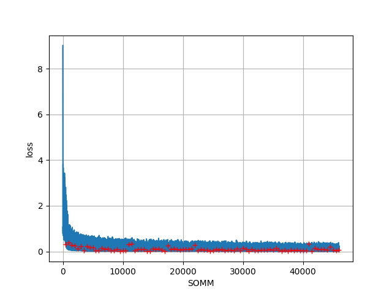

本文件为该目录（./language）下模型的具体介绍

# DCNN
是声学模型中的DCBNN到语言模型的迁移。

## DCNN1D
是比较差的语言模型，直觉上因为特征步长过少，卷积层增多时感受野太大忽略了局部特征，导致了该模型的失败。2019年7月1日停止维护，此时发现了somiao输入法，开始将其结构迁移到本项目。

# SOMM

该模型其实是参考了somiao输入法，借鉴了其网络结构的keras版，原版本有七百多万个参数，我去掉了其中的GRU，并减少了其中的拼接层数，将参数量减少到了三百万以内，发现仍然有很好的效果。

一开始训练的粒度是词级别的，即为`SOMMword`，后来发现词级别的一旦拼音出错效果就会很差，因此选择了字母粒度的，即`SOMMalpha`

这两个模型结构相同，就是输入有些不同，但最终都能达到很好的效果

同时如果针对声学模型识别的错误拼音有计划的增加噪音，联合模型的效果可能会更好，目前我还没有尝试

# HMM

在搜寻中发现了一个开源库Pinyin2Hanzi，我把其中的参数和代码直接拷贝过来封装了一下，即该HMM，其实现方式不是很常规，包括训练之类的代码也没有写（在原项目中有但是我没有拷贝过来），有一定的效果，但是不好测试，参数对应的语料可能不是很足够。